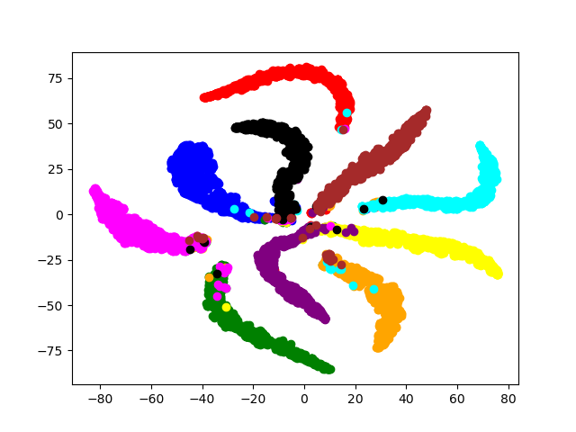
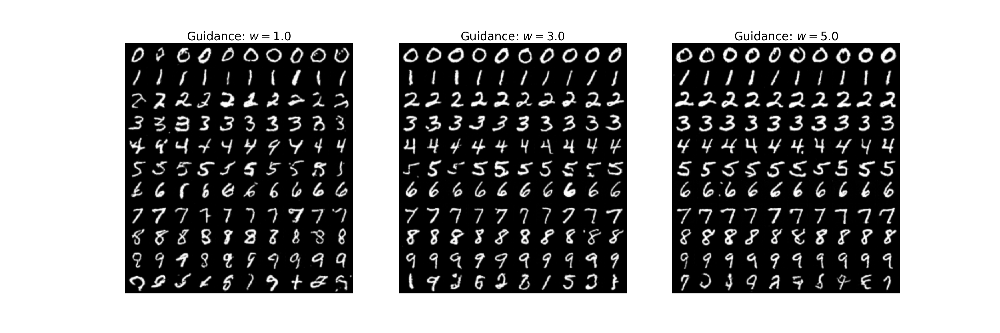

# MNIST - Experiments with CNN, VAE, and t-SNE

This repository is meant to improve my understanding of deep learning. It contains multiple small experiments I created to understand specialized architectures, such as Convolutional Neural Networks (CNNs), Variational Autoencoders (VAEs), and t-SNE for data visualization.

## Features

- **CNN and VAE**: Implementation of Convolutional Neural Networks and Variational Autoencoders for feature extraction and generative tasks.
- **t-SNE Visualization**: Dimensionality reduction using t-SNE to visualize the latent space and data distributions.
- **Focal Loss**: Custom loss function for addressing imbalanced data.
- **Visualization of Weights**: Tools to analyze and interpret learned weights.
- **Generative Features**: Ability to generate samples from latent space.

---

## Repository Structure

```
.
├── generation/         # Scripts for generating data/samples
├── logs/               # Logs for training and evaluation
├── .gitignore          # Git ignore file
├── evaluation.py       # Script for model evaluation
├── focal_loss.py       # Implementation of focal loss
├── model.py            # Definition of model architectures (CNN and VAE)
├── t_SNE.py            # Implementation of t-SNE for visualization
├── train.py            # Training scripts for models
├── visualisation.py    # Visualization tools
```

---

## Examples of t-SNE Plots

<!-- Below are some examples of the t-SNE visualizations generated from the latent space of the trained models: -->

<!-- ### t-SNE Plot: Latent Space of VAE -->
<!--  -->

### t-SNE Plot: Classfier


---
## Generation Results

### Handwritten digit generation using flow matching


---

## How to Use

1. Clone the repository:
   ```bash
   git clone https://github.com/akshit-salhotra/MNIST.git
   cd MNIST
   ```


2. Train a model:
   ```bash
   python train.py
   ```

3. Generate t-SNE plots:
   ```bash
   python t_SNE.py
   ```

4. Evaluate the model:
   ```bash
   python evaluation.py
   ```

---

## Results

- **Validation Accuracy**: 0.96
- **Validation Loss**: 0.1
- **Visualization**: Refer to the t-SNE plots above for insights into the latent space.

---

## Future Work

- Implement more advanced generative models (e.g., GANs).
- Experiment with different datasets.
- Extend visualization tools.

---

## License

This project is licensed under the [MIT License](LICENSE).

---

## Acknowledgments

Special thanks to the deep learning community and open-source contributors for their amazing tools and resources.
